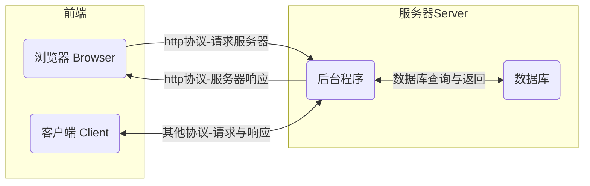

# 程序员的工作

## 互联网的发展阶段

现在的软件行业发展已经进入了万物互联的时代，几乎所有的软件应用都要依赖于互联网。

上网的目的：聊天、追剧、打游戏 ……

**上网的本质目的是获取和消费资源。**

### 互联网服务框架

BS（Browser/Server）与CS（Client/Server）架构

服务器：上网过程中，负责存放和对外提供资源的电脑。

浏览器/客户端：上网过程中，负责获取和消费资源的电脑。

> 软件行业是一种特殊的制造业，制造的东西并不是实体。

## 程序员的职业方向

## 程序员的职业技能

## 看看都有哪些工作

[拉钩网](https://www.lagou.com/)

## 程序员与AI

目前的人工智能发展可以一定程度的提高程序工作效率，但是并不能替代程序员的工作。

> 如果人工智能可以完全替代程序员，那99%的工作就可以由人工智能替代。

