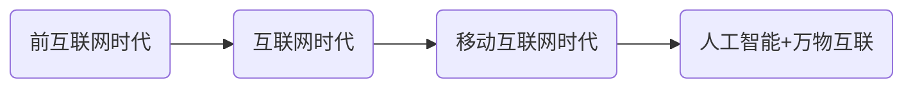
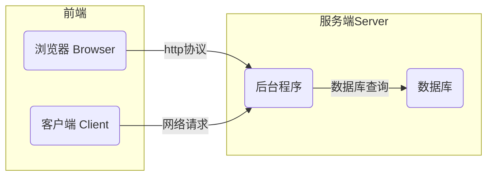

# 程序员的工作

## 互联网的发展阶段

现在的软件行业发展已经进入了万物互联的时代，几乎所有的软件应用都要依赖于互联网。

### 互联网服务框架

BS（Browser/Server）与CS（Client/Server）架构

## 程序员的职业方向

## 程序员的职业技能

[拉钩网](https://www.lagou.com/)——看看都有哪些工作。

## AI与程序员

ChatGBT 基于大数据的模型，数据量 $10^{25}$ 的数据点，是一种大数据的"涌现现象"。
