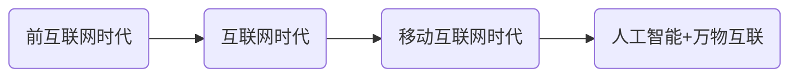
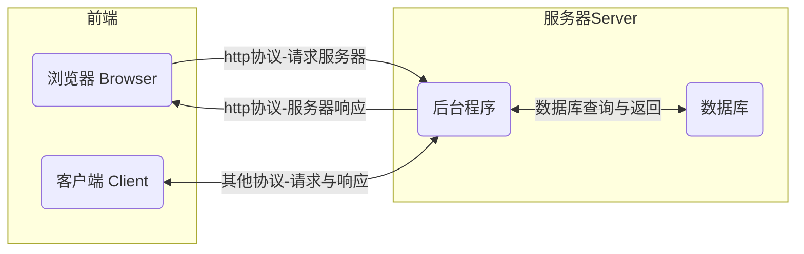
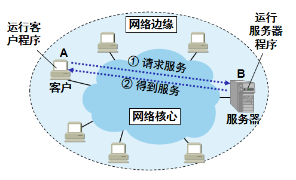
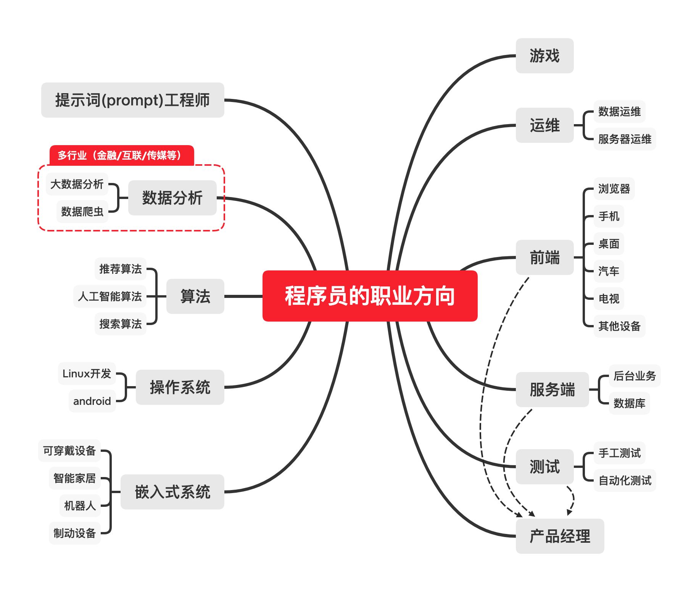
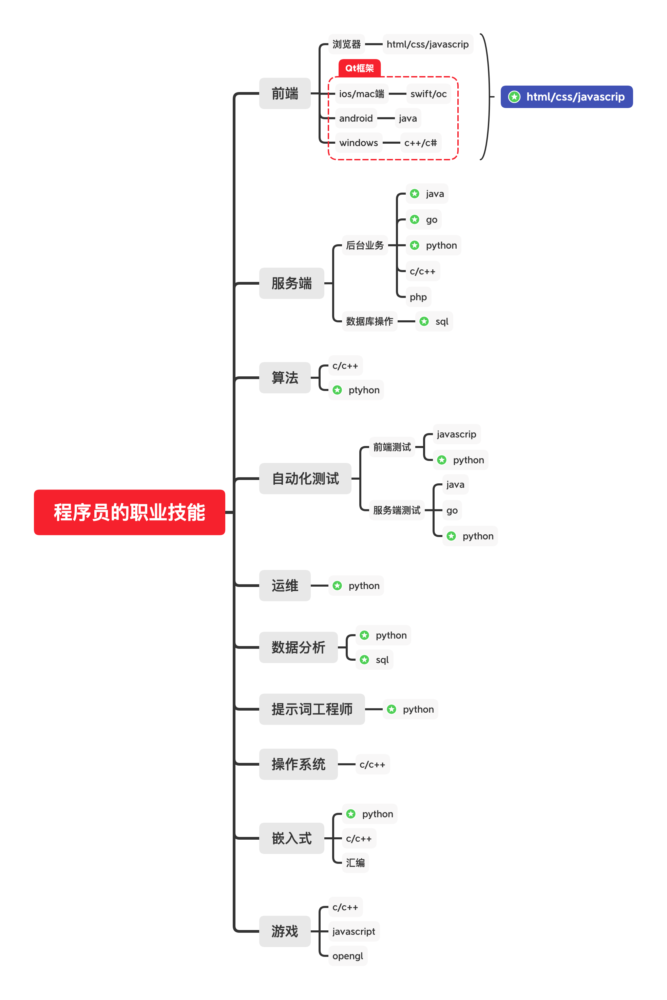

# 程序员的工作

## 互联网的发展阶段

现在的软件行业发展已经进入了万物互联的时代，几乎所有的软件应用都要依赖于互联网。

上网的目的：聊天、追剧、打游戏 ……

**上网的本质目的是获取和消费资源。**

### 互联网服务框架

BS（Browser/Server）与CS（Client/Server）架构

服务器：上网过程中，负责存放和对外提供资源的电脑。

浏览器/客户端：上网过程中，负责获取和消费资源的电脑。

### 软件行业的性质

第一产业是指农、林、牧、渔业。 

第二产业是指采矿业，制造业，电力、燃气及水的生产和供应业，建筑业。

第三产业是指除第一、二产业以外的其他行业。

## 程序员的职业方向

## 程序员的职业技能

[拉钩网](https://www.lagou.com/)——看看都有哪些工作。

## AI与程序员

ChatGBT 基于大数据的模型，数据量 $10^{25}$ 的数据点，是一种大数据的"涌现现象"。
