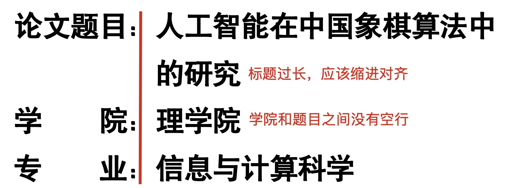

# 毕业论文

## 毕业论文一般周期

毕业论文的一般周期包括：秋季学期的15-16周和春节学期的1-16周。

1. 秋季学期15-16周，完成选题和任务书。
2. 春季学期1周开题答辩。
3. 春季学期6周中期检查。
4. 春季学期10周完成论文。
5. 春季学期11周完成规范性检测、查重检测。
6. 春季学期12周到15周，根据检测结果完善和修改论。
7. 春季16周完成论文答辩。

## 论文周记

### 周记周期

1. 秋季学期15-16周。
2. 春节学期1-16周。

### 周记格式

周记主要内容

* 本周工作要点
* 本周工作中存在的问题

周记的生成，可以使用如下提示词，在大语言模型中生成周报。

```shell
我是一名大四本科生，正在完成毕业设计。
我的毕业设计课题是：基于Flask的电商网站后台设计
这是毕业设计的第3周
本周的主要工作
1. 根据项目要求，完成电商网站数据库的设计。
2. 创建数据库表，包括用户，商品、购买交易记录等内容。
3. 完成了用户注册、登录，修改用户信息的接口。

存在的问题
1. 接口登录后如何记录用户信息
2. 如何保证请求是来着同一用户
以上内容帮我生成300字左右的周报，周报的叙述风格严谨且平实。
```

周记范文

> 本周是毕业设计的第3周，主要围绕基于Flask的电商网站后台设计展开工作，目前已取得一定进展。
> 在数据库设计方面，依据项目需求，成功完成了电商网站数据库的设计，并创建了包括用户、商品、购买交易记录等关键内容的数据库表，为后续的数据存储与管理奠定了基础。同时，顺利实现了用户注册、登录以及修改用户信息的接口，这些接口的完成使得用户能够在前端与后台之间进行初步的交互操作。
> 然而，在开发过程中也遇到了一些问题。首先，关于接口登录后如何记录用户信息，目前尚未找到最佳解决方案，这直接影响到后续用户在网站内的个性化体验与数据关联。其次，在保证请求来自同一用户方面也存在困惑，需要确保每个用户的操作都能被准确识别和追踪，以维护数据的安全性与完整性。

## 论文开题

春季学期1周开题答辩，开题需要准备：

1. 在系统中填写开题报告，并打印。
2. 准备开题PPT，开题答辩报告内容5分钟左右。

> [!warning]
>
> 开题报告中需要填写引用文献，引用文献不少于5篇，英文文献不少于2篇。

## 论文写作

1. 论文整体格式符合模板要求。
   * 注意页首标题。
2. 论文封面要填写评阅人。


3. 标题内容过长应该缩进，学院和题目之间没有空行。



4. 注意页码问题：

   * 封面无页码。
   
   
      * 中英文摘要、目录页码应该**统一为大写罗马数字**。
   
   
      * 论文正文页码应该为大小阿拉伯数字。
   

5. 去掉论文模版中的顶栏


6. 引用文献：

   * 实践类论文，引用文献**不少于15篇**，英文文献**不少于5篇**。
   
   
      * 总数类论文，引用文献**不少于25篇**，英文文献**不少于5篇**。
   
   
      * 引用文献，尽量选择学术论文。
   
   
      * 应用文献中应用**包括文献的页码**。
   

7. 去除标点符号，论文内容应该在**一万字**以上。

8. 删除附录。

9. 删除论文中与论文无关的标记。

10. 注意论文标题中的英文单词大小写问题。

