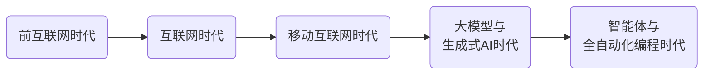
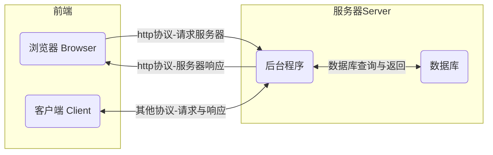
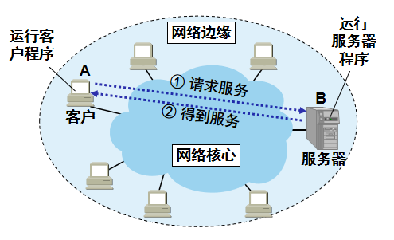
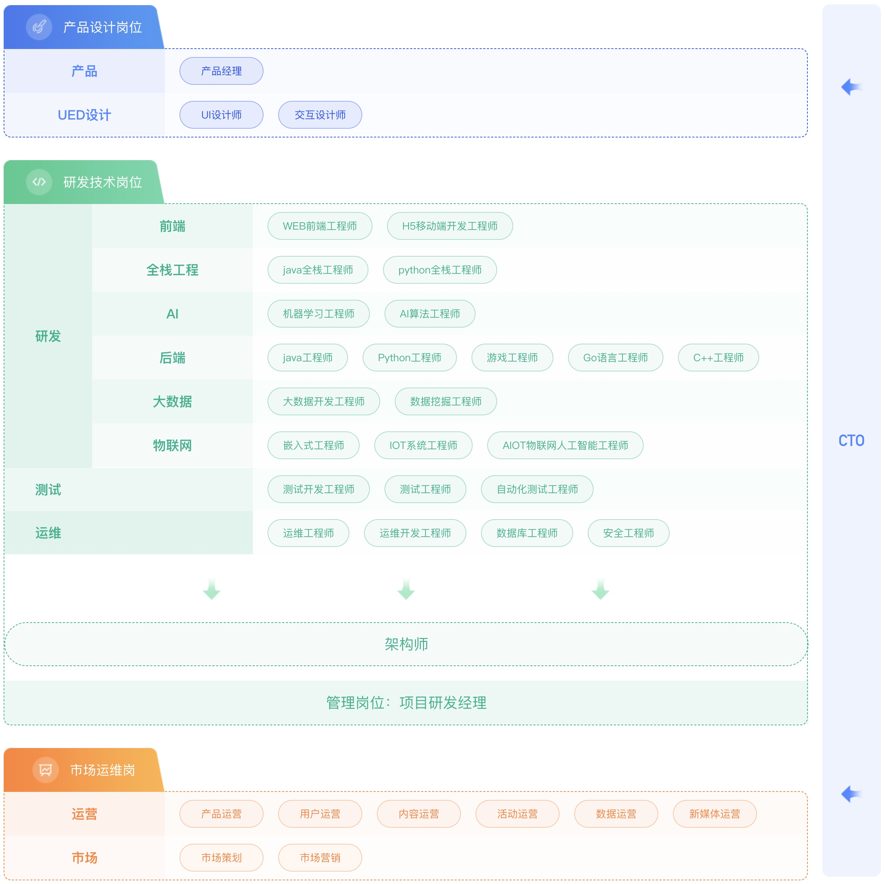
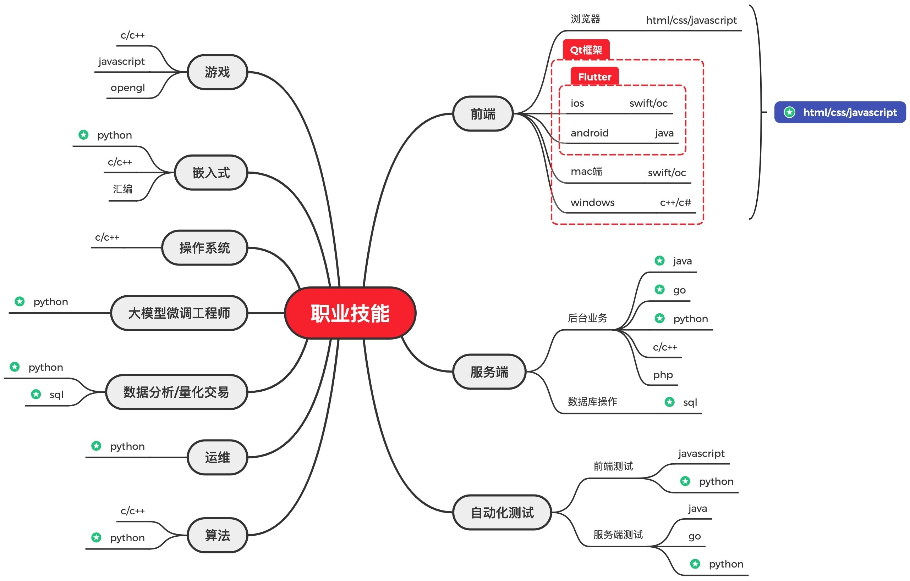

# 编程能做哪些工作

现在所有的软件和服务都要依托于互联网：

* 上网的目的：聊天、追剧、打游戏、使用AI工具……
* 上网的本质目的是获取和消费资源。

## 互联网服务框架

BS（Browser/Server）与CS（Client/Server）架构

* 服务器：上网过程中，负责存放和对外提供资源的电脑。
* 浏览器/客户端：上网过程中，负责获取和消费资源的电脑。

## 与编程相关的工作

### 编程在其他行业的应用

1. 金融行业
   * 数据分析：从海量数据中提取规律与洞察，辅助业务决策。
   * 量化交易：将投资策略编写为自动化程序，由计算机根据历史与实时市场数据，执行无情绪、高频率的买卖决策。
   * 风险控制：构建信用评分模型，评估贷款违约概率。
   * 区块链与加密货币：编写智能合约、开发去中心化应用。
2. 生物信息学与医疗健康
   * 基因测序分析：用Python/R分析DNA序列，寻找致病基因突变。
   * 医学影像识别：用深度学习自动识别CT、MRI中的肿瘤或病变。
   * 药物研发：通过分子动力学模拟和AI模型筛选潜在化合物，加速新药上市。
   * 电子病历分析：挖掘患者数据，预测疾病风险或治疗效果。
3. 工程与制造
   * 机器人控制：用C++/ROS编写工业机器人的路径规划、抓取逻辑。
   * 数字孪生：创建产线或设备的虚拟副本，通过传感器数据实时模拟和优化性能。
4. 交通运输与物流
   * 路径优化：使用运筹学算法为快递车、外卖骑手规划最短或最快路线。
   * 自动驾驶：感知（物体检测）、决策（行为规划）、控制（转向/油门）全部依赖C++/Python。

## 职业技能

## 看看都有哪些工作

[BOSS直聘](https://www.zhipin.com/beijing/?seoRefer=index)

## AI时代的程序员

| 传统程序员             | AI时的程序员                                                 |
| ---------------------- | ------------------------------------------------------------ |
| 掌握语法、完成简单功能 | 审核AI生成代码、调试、测试，能用自然语言准确描述需求。       |
| 独立模块开发、代码规范 | 设计人与AI的分工、优化提示词、重构AI输出、评估代码安全性。   |
| 系统设计、技术选型     | 借助AI能力进行快速决策，评估AI带来的技术风险。               |
| 团队管理、项目推进     | 建立AI辅助开发流程、培养团队AI协作能力、判断哪些工作不适合交给AI。 |

> [!important]
> 
> AI辅助编程的发展，正在让“编程能力”不再局限于程序员群体。许多行业的从业者借助AI，无需深入学习语法即可完成自动化任务，从而显著的提升生产力。

## 课外阅读

| 书名                                                         | 图书馆索书号   |
| ------------------------------------------------------------ | -------------- |
| [程序员的README](https://book.douban.com/subject/36457109/)  | TP311/78       |
| [软技能（代码之外的生存指南）](https://book.douban.com/subject/36044253/) | C913.2/398     |
| [程序员的自我修养](https://book.douban.com/subject/3652388/) | TP311.1/97     |
| [代码整洁之道](https://book.douban.com/subject/34986245/)    | TP311.52/220=2 |
| [重构（改善既有代码的设计）](https://book.douban.com/subject/30468597/) | TP311.11/54=4  |
| [程序员修炼之道（通向务实的最高境界）](https://book.douban.com/subject/35006892/) | TP311.1/58=3   |
