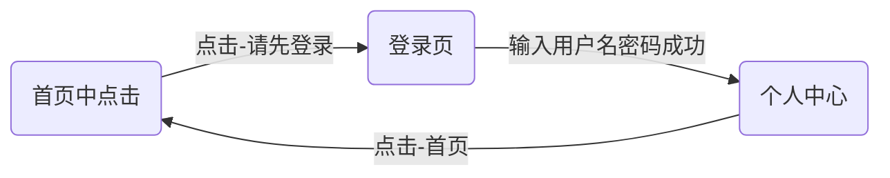

# 计算机网络基础及应用 Ⅰ 作业

## 平时作业

### 作业一

| 题号 | Lintcode 序号 | 题目                                                         |
| ---- | ------------- | ------------------------------------------------------------ |
| 1    | 3065          | [HTML 的基本语法](https://www.lintcode.com/problem/3065/?showListFe=true&page=1&problemTypeId=16&pageSize=50) |
| 2    | 3071          | [图片标签img](https://www.lintcode.com/problem/3071/?showListFe=true&page=1&problemTypeId=16&pageSize=50) |
| 3    | 3113          | [HTML 字符实体](https://www.lintcode.com/problem/3113/?showListFe=true&page=1&problemTypeId=16&pageSize=50) |
| 4    | 3106          | [标签包裹输入框 label](https://www.lintcode.com/problem/3106/?showListFe=true&page=1&problemTypeId=16&pageSize=50) |
| 5    | 3063          | [HTML 页面标题标签 title](https://www.lintcode.com/problem/3063/?showListFe=true&page=1&problemTypeId=16&pageSize=50) |
| 6    | 3104          | [下拉菜单标签 select](https://www.lintcode.com/problem/3104/?showListFe=true&page=1&problemTypeId=16&pageSize=50) |
| 7    | 3100          | [文本域标签 textarea](https://www.lintcode.com/problem/3100/?showListFe=true&page=1&problemTypeId=16&pageSize=50) |
| 8    | 3098          | [按钮标签 button](https://www.lintcode.com/problem/3098/?showListFe=true&page=1&problemTypeId=16&pageSize=50) |
| 9    | 2910          | [添加一个一级标题 Hello LintCode!](https://www.lintcode.com/problem/2910/?showListFe=false&page=2&problemTypeId=16&pageSize=50) |
| 10   | 2914          | [书写一个有序列表](https://www.lintcode.com/problem/2914/?showListFe=true&page=2&problemTypeId=16&pageSize=50) |

### 作业二

| 题号 | Lintcode 序号 | 题目                                                         |
| ---- | ------------- | ------------------------------------------------------------ |
| 1    | 3017          | [修改文字大小](https://www.lintcode.com/problem/3017/?showListFe=true&page=1&problemTypeId=16&pageSize=50) |
| 2    | 3014          | [制作水平导航栏（三）](https://www.lintcode.com/problem/3014/?showListFe=true&page=1&problemTypeId=16&pageSize=50) |
| 3    | 3013          | [左右分布的多种方法](https://www.lintcode.com/problem/3013/?showListFe=true&page=1&problemTypeId=16&pageSize=50) |
| 4    | 3005          | [彩色的标签](https://www.lintcode.com/problem/3005/?showListFe=true&page=1&problemTypeId=16&pageSize=50) |
| 5    | 3003          | [炫酷的文字](https://www.lintcode.com/problem/3003/?showListFe=true&page=1&problemTypeId=16&pageSize=50) |
| 6    | 2996          | [制作学生信息表格](https://www.lintcode.com/problem/2996/?showListFe=true&page=1&problemTypeId=16&pageSize=50) |
| 7    | 2989          | [选择一门最喜欢的课程](https://www.lintcode.com/problem/2989/?showListFe=true&page=2&problemTypeId=16&pageSize=50) |
| 8    | 2983          | [炫酷的按钮](https://www.lintcode.com/problem/2983/?showListFe=true&page=2&problemTypeId=16&pageSize=50) |
| 9    | 2982          | [滚不走的第十行](https://www.lintcode.com/problem/2982/?showListFe=true&page=2&problemTypeId=16&pageSize=50) |
| 10   | 2976          | [添加进度条](https://www.lintcode.com/problem/2976/?showListFe=true&page=2&problemTypeId=16&pageSize=50) |

### 作业三

| 题号 | Lintcode 序号 | 题目 |
| ---- | ------------- | ---- |
| 1    |               |      |
| 2    |               |      |
| 3    |               |      |
| 4    |               |      |
| 5    |               |      |
| 6    |               |      |
| 7    |               |      |
| 8    |               |      |
| 9    |               |      |
| 10   |               |      |

### 平时作业评分标准

完成Lintcode算法题目，并提交报告。

1. 每次作业测试10题，每题8分，共80分。
2. 代码结构清晰、注释清楚，共10分
3. 报告格式符合规范，共10分。

每次作业满分100分。

## 期末大作业

### 电商网站的前端页面

根据[大作业提供的素材](https://resource-443.webvpn.ncut.edu.cn/asset/#/share?shareId=db619ec09d63e7745d21255310ee9d25)完成一个电商网站的前端页面，需要使用HTML、CSS和JavaScript三种前端编程语言。前端页面包括：

1. 电商网站首页。
2. 用户个人主页。
3. 登录页。

页面的跳转逻辑如下

页面中的用户名和密码统一设置为`admin`和`123456`。

### 作业要求

1. 将制作完的网页（包括图片素材和网页文件）打包为`.zip`压缩文件提交到作业收集表中。
2. 根据报告模板完成大作业报告。
3. 报告包括但不限于如下内容：
   * 系统的文件目录
   * 系统模块关系说明
   * 相关模块功能
   * 报告中应该引用关键代码
4. 报告内容规范可以参考[《软件系统设计说明书》](https://cloud.tencent.com/developer/article/2037437)

### 期末大作业评分标准

#### 系统页面完成度（50分）

1. 网站首页（20分）

2. 个人中心页（10分）

3. 登录页（5分）

4. 跳转逻辑正确（10分）

5. 用户名密码可以正确输入（5分）

#### 代码格式规范（10分）

1. 代码风格与可读性（5分）

   - 代码风格：遵循Python编程规范，代码结构清晰，命名规范。

   - 代码注释：提供必要的代码注释，注释内容准确，能够帮助理解代码功能。

2. 错误处理与异常管理（5分）

   - 错误处理：说明系统中各功能的错误处理方式，确保系统在异常情况下的稳定性。

   - 异常管理：描述在代码中如何处理异常情况，并提供相关代码示例。

#### 报告格式规范（10分）

1. 格式规范与整洁度（5分）

   - 格式规范：报告格式规范，包括目录、页码等基本要素。

   - 整洁度：文档排版整洁，段落分明，图文并茂。

2. 图表与示例（5分）

   - 图表：在报告中提供必要的图表，如系统架构图、数据流程图等。

   - 示例：通过示例说明系统的功能和操作过程。

#### 报告内容（20分）

1. 系统功能描述（10分）

   - 功能描述：详细描述系统的各项功能，说明各功能的实现细节。

   - 模块说明：提供各功能模块的说明，包括输入输出、处理逻辑等。

2. 测试与验证（10分）

   - 测试过程：描述系统测试的详细过程。

   - 测试结果：提供测试结果，证明系统功能的正确性。

#### 语言表述（10分）

1. 表达清晰与逻辑性（5分）

   - 表达清晰：报告语言表达清晰，逻辑严谨，能够准确传达设计思想和实现过程。

   - 逻辑性：报告内容条理清晰，逻辑关系明确。

2. 专业术语使用（5分）

   - 专业术语：正确使用专业术语，体现对相关知识的掌握。

   - 术语解释：对一些重要的专业术语进行解释，以便理解报告内容。
