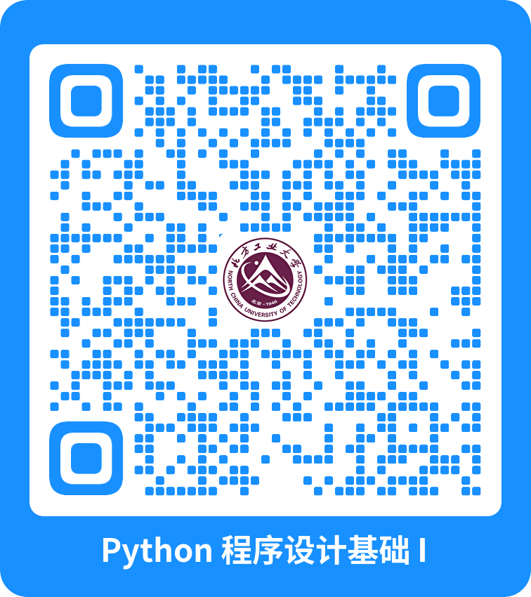

# Python 程序设计基础 I

[授课教师：徐夙](https://hughxusu.github.io/lesson-index/#/c-teacher)

本站网址：https://hughxusu.github.io/lesson-index/#/outline/python

## 课程主要内容

1. [程序员的工作](https://hughxusu.github.io/lesson-index/#/a-coder-work) 
2. [如何学习编程](https://hughxusu.github.io/lesson-index/#/b-how-study)
3. [Python语言](https://hughxusu.github.io/lesson-py/#/)
4. [正则表达式]()
5. [MySQL与Python接口](https://hughxusu.github.io/lesson-mysql/#/)
6. [Git仓库使用]()

## 成绩考核

* 平时成绩占总成绩 30%，共100分。
  * 课堂表现和随机抽查点名或回答问题5次，占20%。
  * 6次平时作业每次，第一次占20%，后五次每次占12%。

* 期末大作业 70%，共100分。

## 平时作业

作业要求：

1. 作业文档一word格式提交，如果是代码页拷贝到word文档中。
2. word报告需要包括：题号，题目，代码。**如有执行结果，添加执行结果的截图。**
3. 每位同学提交word文档，文件命名格式是 `学号_班级_姓名`，例如：`2001092_信2202_张三`。**（注意：每位同学提交文件或压缩包需要严格按照该格式给文件命名）**
4. 文件提交邮箱为 hughxusu@ncut.edu.cn**（注意：提交作业最好使用邮件提交）**邮件标题为：`课程_学号_班级_姓名`，例如：`Python程序设计基础I_2001092_信2202_张三`
5. 报告模板在资源下载中。

> [!attention]
>
> 如果没有按规范格式提交作业，导致作业没有收集到，该次平时成绩会被扣除。

### 作业一（第一周）

写一篇不少于300字的职业或人生规划，可以包括如下内容：

1. 毕业后的人生计划。
2. 个人的职业兴趣和职业计划。
3. 如何实现自己的人生计划或职业计划。

## 期末大作业

作业要求：

1. 根据题目要求以小组为单位，完成课程设计。
2. 最后两次课，根据课程设计的内容进行答辩。
3. 每位同学都要提交设计报告，设计报告需要双面打印提交。
4. 报告随答辩过程提交。
5. 报告模板在资源下载中。

### 使用网络爬虫爬取任意两位唐代诗人的全部作品

#### 任务要求

1. 使用Python语言的网络爬虫框架实现数据爬取 [Scarpy](https://www.runoob.com/w3cnote/scrapy-detail.html)
2. 找到一个合适的唐诗网站爬取相关数据
3. 选择任意两位诗人（李白、杜甫等）
4. 爬取数据要保存到数据 MySQL 数据库中
5. 网络爬虫框架需要自学

## 资源下载

百度网盘: https://pan.baidu.com/s/1ZxrHOb75zrsfLQbjqEkd-Q 提取码: 5hc9 
